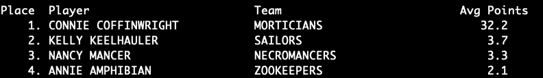

[README](../README.md) 

# z/OS COBOL Labs 

### COBOL Lab 1 - Compile and run a COBOL program 

Upload sample program ```cobol/HELLO.cbl``` from this repository to your source library, ```<userid>.COBOL.SOURCE(HELLO)```.

In your JCL library, ```<userid>.INNOV.JCL```, create a new member to contain JCL to compile and bind a COBOL program. You can use the sample job in ```jcl/CBLBATCH.jcl``` as a model for this JCL. Also refer to _COBOL Module 2 - Compile_ for more information.

Run your batch compile job to compile and bind the HELLO program. 

Now create a new JCL member to execute the HELLO program. You will need one step, with PGM=HELLO on the EXEC statement. You will need a SYSOUT DD for the program output. 

Run the HELLO job and review the output using SDSF. 


### COBOL Lab 2 - Modify, compile, and run a COBOL program

Modify the HELLO program so that the output reads, 

```Hello, World!``` 

```My name is <your name here>. Look on my works, ye mighty, and despair!"```

Use your compile and bind job to prepare the program for execution, then run your HELLO job. 

Use SDSF to review the output.	


### COBOL Lab 3 - Working with strings and text, part 1

Refer to material in _COBOL Module 4 - Strings and Text, Part 1_ for guidance.

Upload program ```labs/STR1.cbl``` as ```<userid>.COBOL.SOURCE(STR1)```. 

Follow the instructions in the source comments of STR1 to complete the missing code. 

Compile, bind, and run the program.

Use SDSF to review the output. 


### COBOL Lab 4 - Working with strings and text, part 2

Refer to material in _COBOL Module 5 - Strings and Text, Part 2_ for guidance.

Upload program ```labs/STR2.cbl``` as ```<userid>.COBOL.SOURCE(STR2)```. 

Follow the instructions in the source comments of STR2 to complete the missing code. 

Compile, bind, and run the program.

Use SDSF to review the output. 


### COBOL Lab 5 - Working with strings and text, part 3

Refer to material in _COBOL Module 6 - Strings and Text, Part 3_ for guidance.

Upload program ```labs/STR3.cbl``` as ```<userid>.COBOL.SOURCE(STR3)```. 

Follow the instructions in the source comments of STR3 to complete the missing code. 

Compile, bind, and run the program.

Use SDSF to review the output.


### COBOL Lab 6 - Arithmetic

Refer to material in _COBOL Module 7 - Arithmetic_ for guidance.

Upload program ```labs/ARITH.cbl``` as ```<userid>.COBOL.SOURCE(ARITH)```.

Follow the instructions in the source comments of ARITH to complete the missing code. 

Compile, bind, and run the program.

Use SDSF to review the output.


### COBOL Lab 7 - Date and Time, Tables

Refer to material in _COBOL Module 8 - Working with Dates and Times_ for guidance.

Upload program ```labs/DTIME.cbl``` as ```<userid>.COBOL.SOURCE(DTIME)```.

Follow the instructions in the source comments of DTIME to complete the missing code. 

Compile, bind, and run the program.

Use SDSF to review the output.


### COBOL Lab 8 - Searching Tables, Processing Sequential Data Sets 

Refer to material in _COBOL Module 9 - Tables_ and _COBOL Module 10 - Sequential Data Sets_ for guidance. 

Upload program ```labs/TABSRCH.cbl``` as ```<userid>.COBOL.SOURCE(TABSRCH)```. 

Upload copybook ```labs/TABREC.cbl``` as ```<userid>.COBOL.COPY(TABREC)```.

Upload data file ```labs/mountains.txt``` as ```<userid>.INNOV.TABDATA``` with record format fixed-blocked, logical record length 80, block size 32000. Allocate one track primary, one track secondary. 	

Follow the instructions in the source comments of TABSRCH to complete the missing code. 

Compile, bind, and run the program.

Use SDSF to review the output.


### COBOL Lab 9 - Sorting Tables 

We did not cover this topic in class, but you can find information about it at https://www.ibm.com/docs/en/cobol-zos/6.4?topic=tables-sorting-table. 

This is not a mandatory lab exercise because the system we are using does not support a suitable version of the COBOL compiler. If you have access to IBM Enterprise COBOL 6.x at your place of work, then you can try this exercise. 

Upload program ```labs/TABPLAY.cbl``` as ```<userid>.COBOL.SOURCE(TABPLAY)```. 

Follow the instructions in the source comments of TABPLAY to complete the missing code. 

Compile, bind, and run the program.

Use SDSF to review the output.


### COBOL Lab 10 - VSAM KSDS batch update

Write a batch COBOL program to keep track of free throw statistics for an amateur basketball league.

There are several steps to complete in this lab: 
1. Upload some data files
1. Define and catalog a VSAM KSDS
1. Load the KSDS from a sequential data set 
1. Write a COBOL program to apply updates to the KSDS from a sequential input data set
1. Write JCL to execute the COBOL program

Details: 

(1) Upload the following files:

- Copybook for the Free Throw KSDS record layout: ```labs/FRTHROW.cpy``` ==> ```<userid>.COBOL.COPY(FRTHROW)``` 
- Copybook for the Free Throw QSAM update record layout: ```labs/FRUPDATE.cpy``` ==> ```<userid>.COBOL.COPY(FRUPDATE)``` 
- Seed data to load the KSDS: ```labs/FRSEED.data``` ==> ```<userid>.INNOV.FRSEED```, RECFM FB, LRECL 77, BLKSIZE 7700
- Input updates for the batch job: ```labs/FRUPDATE.data``` ==> ```<userid>.INNOV.FRUPDATE```, RECFM FB, LRECL 80, BLKSIZE 16000

(2) Use your mad IDCAMS skills to write a job that executes IDCAMS to:

1. DELETE cluster ```<userid>.INNOV.FRTHROW``` 
1. DEFINE cluster ```<userid>.INNOV.FRTHROW``` with record size 77 77, key 40 0.
1. REPRO ```<userid>.INNOV.FRSEED``` into ```<userid>.INNOV.FRTHROW```.

(3) Write a COBOL program to apply updates from ```<userid>.INNOV.FRUPDATE``` to ```<userid>.INNOV.FRTHROW```.

Read the input file sequentially and apply the update specified in each record to the KSDS. Note that for a Delete operation, there are no data fields in the update record; only key fields.

The record key comprises two logical fields (adjacent) - Team and Player.

Check File Status values relevant to the I/O operations your program performs. 

The input data may or may not be clean. Write defensive code to avoid S0C7 abends.

(4) Write JCL to execute the COBOL program and apply the updates to the KSDS.

Use the tools you have learned to check the results. For example, you can view batch job output with SDSF; you can run an IDCAMS PRINT job to see the contents of the KSDS, or use ISPF Option 3.4 to do so. 

Based on the input values available in the update file, you can calculate the number of points scored by counting two (2) points for each completed free throw, minus the number of three-pointers, and then add the number of three-pointers times three (3). 

(5) Have fun!

#### COBOL Lab 11 - Create and load DB2 tables 

This exercise doesn't involve writing COBOL source code, but it sets things up for the batch COBOL DB2 labs to follow. 

The VSAM version of the Freethrow data store comprised a single KSDS. For the DB2 version, you're going to create three tables: 

- TEAMS 
- PLAYERS 
- THROWS 

Then you will load the tables with seed data.

Step 1: Create the tables using SPUFI

Using ```labs/DB2 Freethrow TEAMS``` as a guide, use SPUFI to create the ```TEAMS``` table. 

Then, using ```labs/DB2 Freethrow PLAYERS``` as a guide, use SPUFI to create the ```PLAYERS``` table. 

Note there is a one-to-many relationship between ```TEAMS``` and ```PLAYERS```. 

Finally, create the ```THROWS``` table. Define a column for each of the fields in ```labs/FRTHROW.cpy``` _except_ ```FT-Team-Name``` and ```FT-Player-Name```. Include a foreign key column to connect the ```THROWS``` table with the ```PLAYERS``` table. 

Step 2: Load the seed data using SPUFI

Use the file ```labs/FRSEED.data``` as the basis for writing INSERT statements to load the TEAMS, PLAYERS, and THROWS tables. Save the INSERT statements in members of library ```yourid.LAB.SPUFI```.

Use SPUFI to insert the data into the TEAMS, PLAYERS, and THROWS tables. 

Step 3

Using QMF, write a query to select the contents of table THROWS. 

Step 4 

Using QMF and/or SPUFI, develop a query to select the player name, team name, and average points for all the players, without showing duplicates.

Step 5

Using QMF and/or SPUFI, develop a query to list the highest-scoring player on each team based on average points and order the result from highest to lowest points.

Step 6 (optional) 

Prompt an LLM coding assistant to improve the query you developed in Step 5. See if it suggests changes that you didn't think of. Try the changes and see if they work (they might not). 

Step 7 (optional) 

Use an LLM coding assistant to generate a query like the one you developed in Step 5 of this lab. Experiment with different prompts to see how the LLM tool responds and to get a sense of how it may help with the work and what its limitations are. 

#### COBOL Lab 12 - Batch program to list high scoring players 

Write a batch COBOL program that uses the query you developed in Step 5 of COBOL Lab 11 and write the result to SYSOUT. The output should look like this:



#### COBOL Lab 13 - Batch program to list players by team 

Write a batch COBOL program that uses a cursor to process the data in the TEAMS and PLAYERS tables and writes a list of the team members for each team. 

This sounds simple enough, but here's the rest of the story: 

Use ACCEPT to pick up records from SYSIN. Each record contains the name of a team starting in position 1. It's possible that a team name doesn't exist in the database. 

For each team name, set the value of a host variable that is referenced in the WHERE clause of the query. 

Use a _scrollable cursor_. After processing all the rows for a team, close the cursor, get the next team name and set the variable referenced in the WHERE clause, and open the cursor. 


#### COBOL Lab 14 - Batch update program 

Write a batch COBOL program that reads a sequential input file containing updates to the Free Throw data and applies each update to the database. 

The input file is ```labs/FRUPDATE.data```, which you can upload to the lab environment either as a standalone QSAM data set or as a member in a library. 

Records in the input file may or may not be valid. Your program must validate the input records and write erroneous records to a sequential data set with DDNAME ```BADINPUT```. 

Bear in mind an update record might include a new team and/or a new player. Your program has to handle modifications to existing data as well as creation of new data with the correct associations between THROWS and PLAYERS and between PLAYERS and TEAMS. 

Write the JCL such that the ```BADINPUT``` data set will be deleted if it exists before running the COBOL step, and the job will not error out if the data set does not exist. You should remember the DISP= parameter values for this or be able to find your own JCL from a previous lab that does this.

Use DB2 transaction management in your program. Commit each modification to the database, and rollback in case of error. 

If a serious processing error occurs (not merely an invalid input record), set the condition code for the COBOL job step to 12. 


#### COBOL Lab 15 - CICS RECEIVE and SEND 

Write a COBOL CICS program that receives input when it is invoked:

SEIB name 

The program should issue a CICS RECEIVE command to pick up the value the user types after the transaction identifier. 

Use a CICS SEND TEXT command to return the name that was entered and the values of the following fields from the EIBLK:

- EIBDATE, formatted as YYYY/MM/DD 
- EIBTIME, formatted as HH:MM:SS 
- EIBTRNID 

You'll need to call upon your mad COBOL skills to convert the date from the peculiar format CICS uses for EIBDATE: It's a seven-digit packed decimal value with the date represented as follows:

- Digit 1 - unused
- Digit 2 - 0 means 20th century, 1 means 21st century 
- Digits 3-4 - last two digits of the year 
- Digits 5-7 - day of the year 

Hint: You can use a couple of intrinsic functions, along with carefully-structured Working-Storage entries:

- INTEGER-OF-DAY
- DATE-OF-INTEGER 

This might be trickier than it sounds. 

#### COBOL Lab 16 - Convert SHOWEIB to use BMS 

Using the RECEIVE/SEND program you wrote in COBOL Lab 15 as a base, convert the solution so that it uses a EXEC CICS SEND MAP instead of EXEC CICS SEND TEXT. 

That will entail the following steps:

1. Write a BMS mapset definition that matches the layout of the hard-coded output from Lab 15. 
2. Assemble the BMS mapset.
3. Make a copy of program SHOWEIB so you won't lose the version that uses EXEC CICS SEND TEXT.
4. Modify the new program so that it includes the mapset copybook and uses EXEC CICS SEND MAP to display the data. 
5. Define a transaction to invoke your new program using CEDA. Remember to include a GROUP parameter with your userid as the group name.
5. Add the mapset and program to the CSD using CEDA commands. Remember to include a GROUP parameter with your userid as the group name. 
6. Try your new transaction and make adjustments to get the output formatting right. 

Tips

1. Remember that you must do CEDA INSTALL after CEDA DEFINE, or CICS will not pick up the new resource definition until it has been shut down and restarted. 
2. Use any and all resources at your disposal to find information about how to code BMS macros, how to code EXEC CICS commands, and how to troubleshoot problems. You can ask your colleagues, ask your instructor, look for sample code in the course repository, search for information on Stack Overflow, do general Internet searches, use an AI assistant, or just do trial and error. When you get stuck, don't just sit there. Practice with using all these resources is part of the training. You are not being tested to see if your memory is perfect.

